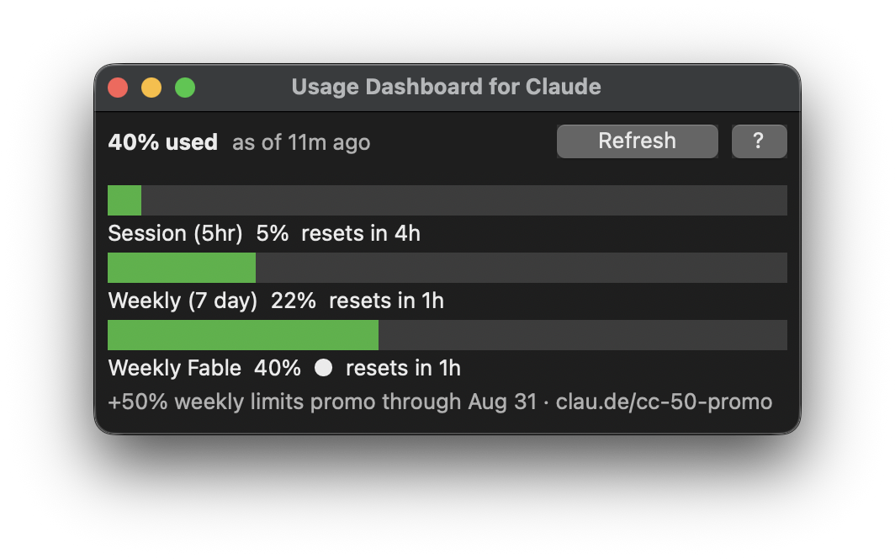

# Usage Dashboard for Claude

Claude Code quota usage from the local `~/.claude.json` cache, shown in a
small always-on-top desktop window that refreshes in the background. Runs on
macOS and Windows.

**Requires [Claude Code](https://claude.com/claude-code).** The dashboard
reads the local cache Claude Code maintains and shells out to the `claude`
CLI for manual refreshes — without Claude Code installed it has nothing to
show.

> This is an unofficial community project and is not affiliated with,
> endorsed by, or sponsored by Anthropic. Claude is a trademark of
> Anthropic, PBC.



A one-shot CLI view of the same reading is also included — see
[docs/CLI.md](docs/CLI.md).

## Install

```bash
pip install -e .
```

This puts `claude-usage-app` (desktop window) and `claude-usage` (CLI) on
your `PATH`. You can also run the app without installing, from the repo root:

```bash
python -m claude_usage.ui.app.main
```

## The window

The window is resizable and grows to fit its content, but never shrinks
below a size you chose. It stays above other windows and never steals focus
when it refreshes — a refresh only repaints. Closing it stops the background
poller and exits.

The window includes a **Refresh** button below the quota display that invokes
`claude -p "/usage"` to refresh Claude Code's quota cache on demand. This is
useful when the window shows "No quota data cached yet". While the refresh runs,
the button displays "Refreshing…" and is disabled. If the refresh fails, hovering
the button shows a tooltip indicating the outcome (e.g., "Last refresh: not_found"
when the `claude` executable cannot be found; set `claude_executable` in
config.toml to specify its path).

A **?** button next to Refresh explains the cost: the refresh spawns a real
(tiny) Claude session, so each click consumes a small amount of your usage
quota. Hover it for the short version, or click it for the full explanation.

The window draws its own text, so the console-encoding caveat that applies to
the CLI on Windows does not apply here.

## Flags

| Flag       | Effect                                               |
|------------|------------------------------------------------------|
| `--path`   | read an alternate `.claude.json` (fixtures, testing) |
| `--config` | read an alternate `config.toml` (fixtures, testing)  |

## Configuration

Optional, read once at startup from
`~/.config/claude-usage/config.toml` (on Windows,
`C:\Users\<you>\.config\claude-usage\config.toml`). No file means defaults,
silently. An unreadable or malformed file, or an out-of-range value, also
falls back to defaults but adds a warning line to the window rather than
failing.

| Key                       | Default | Range  | Effect                                    |
|---------------------------|---------|--------|-------------------------------------------|
| `poll_seconds`            | 10      | 1–600  | seconds between background refreshes      |
| `stale_after_minutes`     | 15      | 1–1440 | reading age at which the view marks STALE |
| `refresh_timeout_seconds` | 60      | 5–600  | timeout in seconds for the Refresh button's `claude -p "/usage"` subprocess |
| `claude_executable`       | absent  | string | explicit path to the `claude` executable for the Refresh button; if unset, resolved from `PATH` |

```toml
poll_seconds = 30
stale_after_minutes = 20
refresh_timeout_seconds = 60
# claude_executable = "/path/to/claude"
```

## Development

```bash
pip install -e .
pip install pytest
pytest
```
